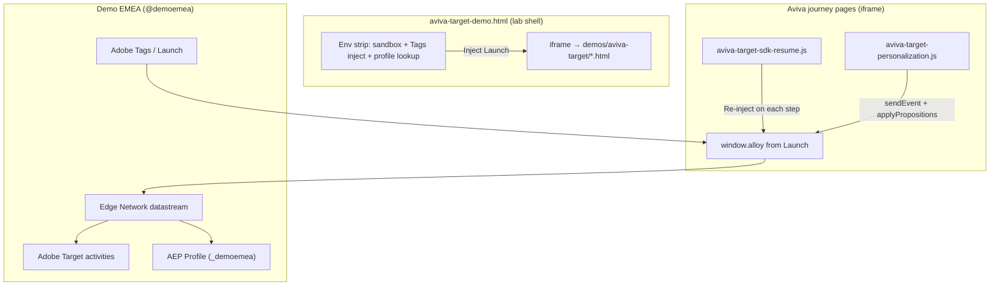

# Aviva car insurance — Adobe Target A/B testing (Demo EMEA)

Lab-hosted journey under **Demos → Aviva → Target → Car insurance journey**, with a **Target lab shell** that injects the Adobe Web SDK (Alloy) via Tags.

## Architecture



| Layer | Role |
|--------|------|
| **`aviva-target-demo.html`** | Profile Viewer lab shell (sandbox, Tags inject, ECID display, profile drawer). Same pattern as Sky / Admiral demos. |
| **`demos/aviva-target/*.html`** | Saved Aviva HTML journey (landing → quote). Runs **inside the iframe**. |
| **`aviva-target-sdk-resume.js`** | Re-injects your persisted Launch script on **every page navigation** (full reloads wipe inline scripts). |
| **`aviva-target-personalization.js`** | After Alloy loads, calls `sendEvent` with **decision scopes** and `applyPropositions` for Target offers. |
| **Your Launch property** | Ships **Web SDK (Alloy)** configured with a Demo EMEA **datastream** and **Target / Personalization** enabled. |

**Live URL (after deploy):**  
`https://aep-orchestration-lab.web.app/profile-viewer/aviva-target-demo.html`

Direct journey pages (no lab strip) still work for styling QA:  
`/profile-viewer/demos/aviva-target/index.html`

---

## What you need in Adobe (Demo EMEA)

### 1. Edge datastream

Create or reuse a **Web SDK datastream** in the Demo EMEA org that:

- Points at your AEP sandbox (e.g. `kirkham`, `demo`, or team default).
- Has **Adobe Target** (and optionally **Experience Event** for profile) enabled.
- Uses the **`_demoemea`** tenant on experience events if you mirror traffic to Profile (see [ANONYMOUS_EDGE_DEMO_PATTERN.md](./ANONYMOUS_EDGE_DEMO_PATTERN.md)).

Note the **datastream ID** — you will enter it in the Launch Web SDK extension (not in this repo).

### 2. Adobe Tags (Launch) property

Create a **Tags property** for the Aviva Target demo:

1. **Adobe Experience Platform Web SDK** extension  
   - Datastream ID (from step 1).  
   - Enable **Personalization** / Target.  
   - Default consent as needed for lab demos.

2. **Identity** — ECID enabled (default).

3. **Rule: Library Loaded (or DOM Ready)**  
   - Action: **Send event** (or custom code) if you prefer explicit page-view events.  
   - The lab’s `aviva-target-personalization.js` also sends `sendEvent` with `decisionScopes` — avoid duplicate conflicting rules unless intentional.

4. **Optional rule: set consent** after cookie accept on landing (`index.html` only shows OneTrust).

5. Publish to a **Development** or **Staging** environment and copy the **`assets.adobedtm.com/.../launch-....min.js`** URL.

### 3. Adobe Target activities

In [Target](https://experience.adobe.com/#/@demoemea/target/activities) (@demoemea):

| Activity type | Best for this demo |
|---------------|-------------------|
| **A/B Test (Web)** | Compare two HTML/CSS variants on a single page (e.g. Step 3 CTA label colour). |
| **Experience Targeting (XT)** | Route audiences (e.g. returning ECID vs new) to different experiences. |
| **Recommendations** | Less common on quote flows; possible on landing hero. |

**Decision scopes (names must match code or your override):**

The repo ships default scope names per page in `aviva-target-personalization.js`:

| Page | Default decision scopes |
|------|-------------------------|
| Landing | `aviva-landing-hero`, `aviva-landing-quote-cta` |
| Step 1 registration | `aviva-step1-registration` |
| Step 1 vehicle | `aviva-step1-vehicle` |
| Step 2 driver | `aviva-step2-driver` |
| Step 3 additional | `aviva-step3-assumptions`, `aviva-step3-continue-cta` |
| Step 4 quote | `aviva-step4-quote-price`, `aviva-step4-quote-cta` |

When creating the activity in Target, use **Form-based experience composer** or **Visual Experience Composer (VEC)**:

- **VEC URL:** open the lab shell, inject Tags, then use the iframe URL e.g.  
  `https://aep-orchestration-lab.web.app/profile-viewer/demos/aviva-target/step3-additional.html`  
  Append `?adobe_authoring_enabled=true` if required for authoring mode.
- Target selectors: prefer stable hooks — add `data-aviva-target-scope="aviva-step3-continue-cta"` on elements you want to personalize (optional; scopes can also use global page locations).

**Override scopes without code changes:**

```html
<script>
  window.AvivaTargetDemoConfig = {
    decisionScopes: ['my-target-activity-scope-name'],
    xdmTenantKey: '_demoemea'
  };
</script>
```

Place that **before** `aviva-target-personalization.js` on a journey page, or set it from a Launch custom code action.

### 4. Audiences (optional)

Build audiences in Target or AEP Segments, e.g.:

- Profile attribute from `_demoemea` traits (after you stream events).
- Geo, new vs returning visitor, QA cookie.

Stitch known profiles: use **Profile lookup** in the lab strip with email, then **Look up profile** — `DemoTagsInjection` sends an identity stitch event.

---

## Lab workflow (presenter)

1. Open **Demos → Aviva → Target → Car insurance journey** (loads `aviva-target-demo.html`).
2. Hover the top strip → choose **AEP sandbox** (Demo EMEA-linked).
3. Select your **Tags property** + **environment** → **Inject selected script**.
4. Confirm **ECID** appears in the strip (anonymous profile in `_demoemea`).
5. Click through the iframe journey (Get a quote → Step 4).
6. Each step re-loads Launch via `aviva-target-sdk-resume.js` and requests Target via `aviva-target-personalization.js`.
7. Validate profile:  
   `GET /api/profile/table?namespace=ecid&identifier={ECID}&sandbox={sandbox}`

**QA toggles:**

- `?mboxDisable=1` on a journey URL — skips personalization requests.
- `?adobe_authoring_enabled=true` — skips auto `sendEvent` so VEC can author.

---

## Repo files (reference)

| File | Purpose |
|------|---------|
| `web/profile-viewer/aviva-target-demo.html` | Lab shell + iframe |
| `web/profile-viewer/aviva-target-demo.js` | `DemoTagsInjection` (`storagePrefix: avivaTarget`) |
| `web/profile-viewer/demos/aviva-target/aviva-target-sdk-resume.js` | Persisted Launch re-inject |
| `web/profile-viewer/demos/aviva-target/aviva-target-personalization.js` | Target `sendEvent` / `applyPropositions` |
| `web/profile-viewer/demos/aviva-target/aviva-journey-patch.js` | Local click-through navigation |
| `web/profile-viewer/demo-tags-injection.js` | Shared Tags inject + `_demoemea` ECID sync |

Re-wire journey `<head>` scripts after re-importing HTML from Downloads:

```bash
node web/profile-viewer/demos/aviva-target/scripts/inject-target-lab-scripts.mjs
```

---

## Example Target experiences to demo

1. **Step 3 — CTA copy test**  
   Scope: `aviva-step3-continue-cta`  
   Experience A: “Continue to your price” (control)  
   Experience B: “See my personalised price”  

2. **Step 4 — Hero price callout**  
   Scope: `aviva-step4-quote-price`  
   Replace or highlight premium panel with Target HTML offer.

3. **Landing — hero banner**  
   Scope: `aviva-landing-hero`  
   Swap hero sub-head or promotional badge for Signature vs Plus positioning.

4. **Audience XT**  
   Returning visitors (profile exists) see discount messaging on Step 4; new visitors see control.

---

## Troubleshooting

| Symptom | Check |
|---------|--------|
| No ECID in strip | Launch injected? Web SDK extension installed? Datastream valid? |
| `alloy not available` in console | Inject Tags from lab shell first; confirm `avivaTargetSdkConfiguredBySandbox` in localStorage. |
| No Target content | Activity published? Scope names match? Activity bound to correct property / datastream? |
| Offer flashes then disappears | Conflicting Aviva saved `_satellite` scripts vs Alloy — expected on clones; Target should win after `applyPropositions`. |
| Different ECID each step | Launch not resumed — confirm `aviva-target-sdk-resume.js` on page; inject once from parent. |
| Profile empty | Include `_demoemea.identification.core.ecid` on events ([pattern doc](./ANONYMOUS_EDGE_DEMO_PATTERN.md)). |

---

## Next steps (optional enhancements)

- Add `data-aviva-target-scope` attributes to specific DOM nodes during HTML import for precise VEC selectors.
- Post journey step events to `/api/events/generator` from the parent shell (Admiral pattern) for faster Profile drawer timelines.
- Wire Target QA links (`at_preview_token`, `at_preview_listed_activities`) via query params on the lab shell.
